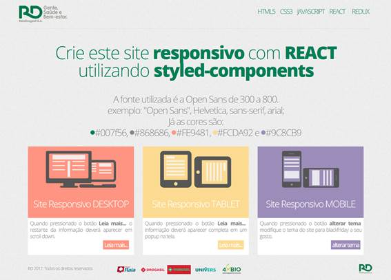

This project was bootstrapped with [Create React App](https://github.com/facebook/create-react-app).

## Drogasil FE Challenge

### Introduction 👋
The coding challenge was to build a responsive website similar to the given design mainly with React and Style-Components.

## Design

## Technologies
The technologies that I have used in this project were: React, Typescript and Styled-Components with SASS and BEM methology.

I opted out on using the flux pattern, with Redux or Context API, due the simplicity of the state management.

## Instalation
In the root project directory, you must run:

### `yarn or npm i`
To install the projects dependencies, and then run

### `yarn start or npm start`
To run the app in the development mode. 
Open [http://localhost:3000](http://localhost:3000) to view it in the browser.

I hope you enjoy :grin: